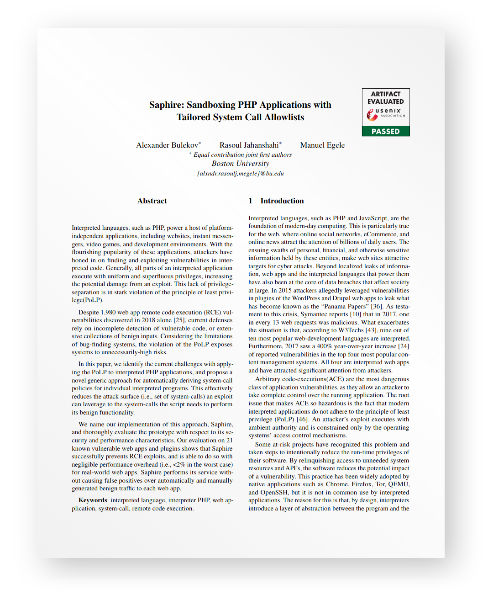
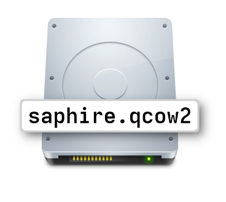

Saphire
=======

<p align="right">
<a href="https://www.usenix.org/system/files/sec21summer_bulekov.pdf">

</p>
</a>
This repository contains the code for our prototype implementation of Saphire,
described in our 
<a href="https://www.usenix.org/system/files/sec21summer_bulekov.pdf">
USENIX 2021 Paper
</a>

Saphire is a mechanism for automatically creating and applying system-call
filters for individual scripts in a PHP web-app.

Here we provide instructions for building Saphire's individual components.

<p>
Additionally, we provide a virtual-disk image that contains a
specially-prepared environment for building and deploying Saphire.
</p>

VM Instructions
-------
<p align="center">
<a href="https://drive.google.com/file/d/1SZs3xss4ADnc6pb0uUJxjpfA2FCWvG1K/view?usp=sharing">
<br>
</a>
</p>

Run the VM
<a href="https://drive.google.com/file/d/1SZs3xss4ADnc6pb0uUJxjpfA2FCWvG1K/view?usp=sharing">image</a>
with <a href="https://www.qemu.org/">QEMU</a> 3.1 or later.
```
qemu-system-x86_64 -machine q35 -accel kvm -m 4096M \
-device virtio-net,netdev=mynet0 \
-netdev user,id=mynet0,hostfwd=tcp:127.0.0.1:22222-:22,hostfwd=tcp:127.0.0.1:8000-:8000 \
./saphire.qcow2
```

Note: the exact procedure for launching the VM depends on your environment. The
command was tested on Linux with KVM installed with the user present in the
"kvm" group. 

For ease of use, the command forwards the VM's ports 22 and 8000 (ssh and http)
to host ports 22222 and 8000 (only accessible from localhost/loopback). Thus, once the
VM boots to the login screen, you can log-in through the GUI, or ssh in with:
`ssh -p22222 paper@localhost`

The VM login details:
- username: `paper`
- password: `saphire2021`

We provide an annotated script for each stage described in our paper in the
home directory:
- `./run_stage1.sh` Analysis over the PHP interpreter

- `./run_stage2.sh` Analysis over the Web App

- `./run_stage3.sh` Deploy the Web-App

We also provide scripts to switch the web-app between WordPress and phpMyAdmin,
and run the exploits.

Set the web-app to phpmyadmin:
```
./switch_to_phpmyadmin.sh
```

First, run stage 1 and output a mapping of PHP function to syscalls. This
stage can take a long time (30+ minutes) as it builds php 7.1 and executes the
PHP test-suite

```
$ ./run_stage1.sh ./stage1_output
```

Then, pass the stage 1 output to stage 2, which outputs syscall filters for
the webapp in /var/www/html. This can take a few minutes:

```
$ ./run_stage2.sh ./stage1_output ./stage2_out_phpmyadmin
```

Run the webapp with Saphire *disabled* to confirm that the exploits work.

```
$ DISABLE_PROTECTION=1 ./run_stage3.sh ./stage2_out_phpmyadmin
```

Exploit the webapp:

```
$ python3 CVE-2018-12613.py -u admin -p admin -U http://localhost:8000/
```
This exploit will output a result.html file. This file will contain some html
code, with the contents of /etc/passwd in the middle. Inspect manually with
less/vim, or:

```
$ grep -a "www-data:x" result.html
```

This should output a match.

Now, run the webapp with protection enabled

```
$ DISABLE_PROTECTION=0 ./run_stage3.sh stage2_output
```

Try to exploit the webapp:

```
$ python3 ~/CVE-2018-12613.py -u admin -p admin -U http://localhost:8000/
$ grep -a "www-data:x" result.html
```

As the exploit should have failed, there will be no match.

You can navigiate to the protected site at:
`http://localhost:8000` (on the host and in the VM)

- Username: `admin`
- Password: `admin`

Now, switch the webapp to WordPress, and re-run stages two and three.  Note:
you do not need to re-run Stage 1 when switching web-apps.

```
$ ./switch_to_wordpress.sh
$ ./run_stage2.sh stage1_output ./stage2_out_wordpress
$ DISABLE_PROTECTION=1 ./run_stage3.sh ./stage2_out_wordpress
```

Start the metasploit docker and run through the WordPress exploits:

```
$ docker run -d --name exploit \
--rm -v /home/paper/wordpress_exploits:/usr/share/exploits \
-it metasploitframework/metasploit-framework
```

```
$ docker exec -it exploit ./msfconsole -r /usr/share/exploits/foxy_exploit.rc
meterpreter> exit
$docker exec -it exploit ./msfconsole -r /usr/share/exploits/wysjia_exploit.rc
meterpreter> exit
$docker exec -it exploit ./msfconsole -r /usr/share/exploits/symposium_exploit.rc
meterpreter> exit
```

These exploits should succeed

Enable protection:
```
$ DISABLE_PROTECTION=0 ./run_stage3.sh ./stage2_out_wordpress
```

Restart the metasploit docker and run through the WordPress exploits:

```
$ docker exec -it exploit ./msfconsole -r /usr/share/exploits/foxy_exploit.rc
$ docker exec -it exploit ./msfconsole -r /usr/share/exploits/wysjia_exploit.rc
$ docker exec -it exploit ./msfconsole -r /usr/share/exploits/symposium_exploit.rc
```

These exploits should fail

You can navigiate to the protected site at:
http://localhost:8000 (on the host and in the VM)

- Username: `admin`
- Password: `admin`

BibTeX for Citations
------
```
@inproceedings {saphire,
	author = {Alexander Bulekov and Rasoul Jahanshahi and Manuel Egele},
	title = {Saphire: Sandboxing {PHP} Applications with Tailored System Call Allowlists},
	booktitle = {{USENIX} Security Symposium},
	year = {2021},
	url = {https://www.usenix.org/conference/usenixsecurity21/presentation/bulekov},
	publisher = {{USENIX} Association},
	month = aug,
}
```
